# 영월고향방앗간 홈페이지 구축 시안


## 1. 프로젝트 개요

### 홈페이지 구축 배경 및 목적
참기름/들기름 시장은 대부분 브랜드 간의 차별성이 약하여, 소비자가 단순 가격 비교를 통해 구매를 결정하는 경향이 있습니다. **영월고향방앗간**은 이러한 문제를 해결하고 단순한 '기름'이 아닌 영월고향방앗간만의 브랜드 가치와 신뢰를 함께 전달하기 위해 기획되었습니다.

- **브랜드 신뢰도 확보 및 가치 전달**: 진정성 있는 브랜드 스토리텔링을 통해 가격 저항을 낮춥니다.
- **제조 공정의 투명화**: 상세한 생산 과정과 철학을 공개하여 소비자 신뢰를 구축합니다.
- **프리미엄 이미지 구축**: 오프라인 패키지 디자인과 통일된 온라인 브랜드 경험을 제공하여 선물용 구매를 유도합니다.

**본 시안의 목적**  
본 시안은 실제 개발에 앞서 영월고향방앗간의 **브랜드 방향성, UX, 디자인 컨셉, 정보 구조**를 정의하고 합의하기 위한 초안(Draft 01)입니다.

<div class="page-break"></div>

## 2. 사이트맵 & 유저 플로우

### 사이트맵 (Sitemap)
직관적이고 단순한 1 Depth 구조를 통해 고객이 길을 잃지 않도록 설계했습니다.

```text
HOME (영월고향방앗간)
├── 브랜드 소개
├── 생산과정
├── 상품보기
│      ├── 참기름
│      ├── 들기름
│      └── 선물세트
├── 상품 상세
├── 장바구니
├── 주문 (구축 예정)
└── 로그인 (구축 예정)
```

### 사용자 흐름 (User Flow)
고객이 브랜드 철학에 설득되어 자연스럽게 구매로 이어지도록 설계된 동선입니다.

광고/SNS ➡️ **메인 홈** ➡️ **브랜드 소개** ➡️ **생산과정** ➡️ **상품목록** ➡️ **상세페이지** ➡️ **장바구니** ➡️ 결제

<div class="page-break"></div>

## 3. 디자인 및 기획 의도

### 전체 톤 앤 매너 (Tone & Manner)
- **프리미엄 & 전통의 현대적 재해석**: 단순한 옛날 방앗간 느낌이 아닌, '고급 백화점 식품관'에 입점할 만한 프리미엄 브랜드 느낌을 주고자 했습니다.
- **색상 시스템 (Muted Tone)**: 눈이 아픈 쨍한 원색을 배제하고, 자연에서 온 차분한 웜그레이/카키톤, 상아색 베이스, 포인트 골드브라운을 주조색으로 사용했습니다.
- **여백과 타이포그래피**: 텍스트 간의 넓은 줄 간격과 여백을 통해 숨 쉴 공간을 주어, 글을 읽는 경험 자체가 '느리고 바른 길을 걷는' 브랜드 철학과 맞닿도록 설계했습니다.

### UX 핵심 요약 (Design & UX Key Points)
이번 `draft_01` 시안은 영월고향방앗간이 지닌 고유한 브랜드 가치를 고객에게 가장 효과적으로 설득하는 데 중점을 두었습니다.
1. **Premium Muted Tone**: 은은한 상아빛(`var(--color-bg)`)과 차분한 카키/웜그레이 톤을 결합하여 전통적이면서도 세련된 분위기를 연출했습니다.
2. **Typography & Spacing**: 텍스트 간격을 넉넉히 주어, 글을 읽는 속도를 늦추고 브랜드가 추구하는 '느림의 미학'을 시각적으로 체감할 수 있도록 설계했습니다.
3. **Responsive UX**: 데스크탑에서는 좌우로 넓게 펼쳐지는 다단 그리드(Grid)를 사용하고, 모바일에서는 위아래로 깔끔하게 스크롤되는 카드 형태로 변환되어 어떤 환경에서도 최적의 가독성을 제공합니다.

<div class="page-break"></div>

## 4. 사이트 시안 스크린샷

> **※ 참고 사항**  
> 본 시안에 포함된 상품 및 배경 이미지들은 기획 의도 전달과 분위기 연출을 위해 **AI로 임시 생성된 이미지**를 사용 중이며, 추후 실제 제품 및 브랜드 촬영 컷으로 모두 교체될 예정입니다.

### 4.1. Main Home (메인 홈)
고객이 브랜드를 처음 접하는 첫인상 영역입니다. 시선을 사로잡는 대형 히어로 배너와 깔끔한 상품 진열로 빠른 구매 동선을 유도합니다.

**PC 화면 (1920px)**
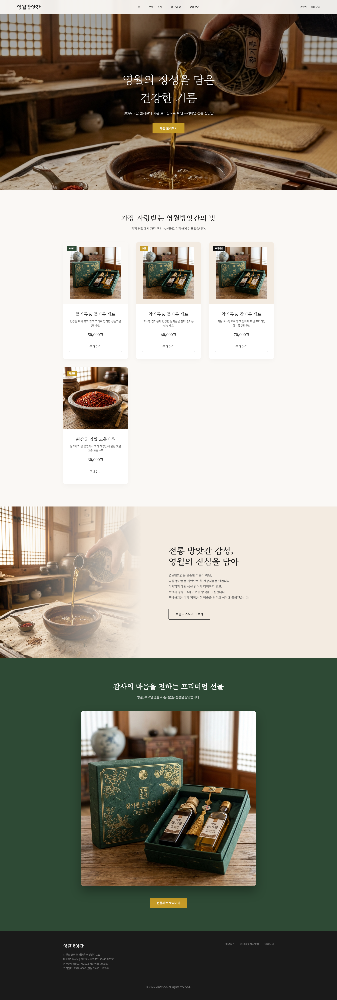

**모바일 화면 (375px)**
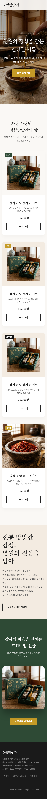

<div class="page-break"></div>

### 4.2. Brand Story (브랜드 스토리)
가격 저항을 낮추고 제품의 가치를 설득하는 공간입니다. 왜 영월인지, 왜 저온 로스팅인지 명확하고 감성적으로 전달합니다.

**PC 화면 (1920px)**
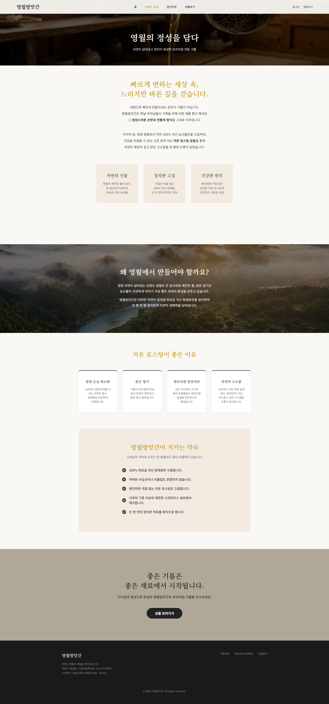

**모바일 화면 (375px)**
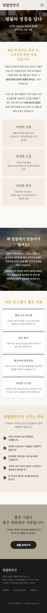

<div class="page-break"></div>

### 4.3. Production Process (생산 과정)
안전한 먹거리에 대한 투명성을 보여주는 페이지입니다. 타임라인 형태의 인포그래픽과 문답형 스토리텔링을 배치했습니다.

**PC 화면 (1920px)**
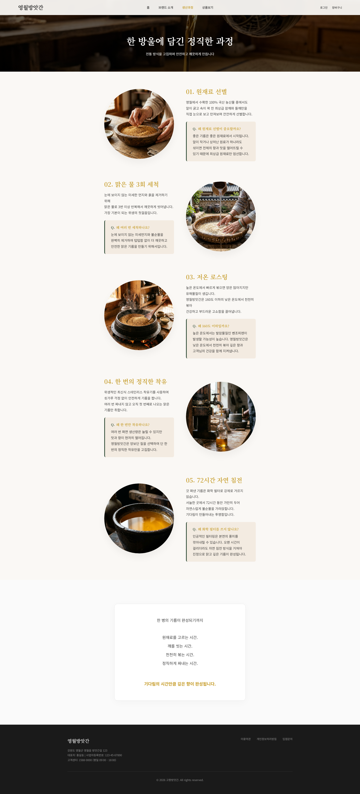

**모바일 화면 (375px)**
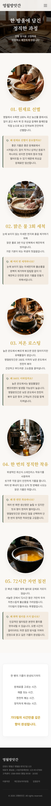

<div class="page-break"></div>

### 4.4. Category (상품 전체보기)
복잡한 수식어를 덜어내고 직관적이고 미니멀한 상품 진열 그리드를 적용하여 오롯이 제품의 퀄리티에 시선이 집중되게 했습니다.

**PC 화면 (1920px)**
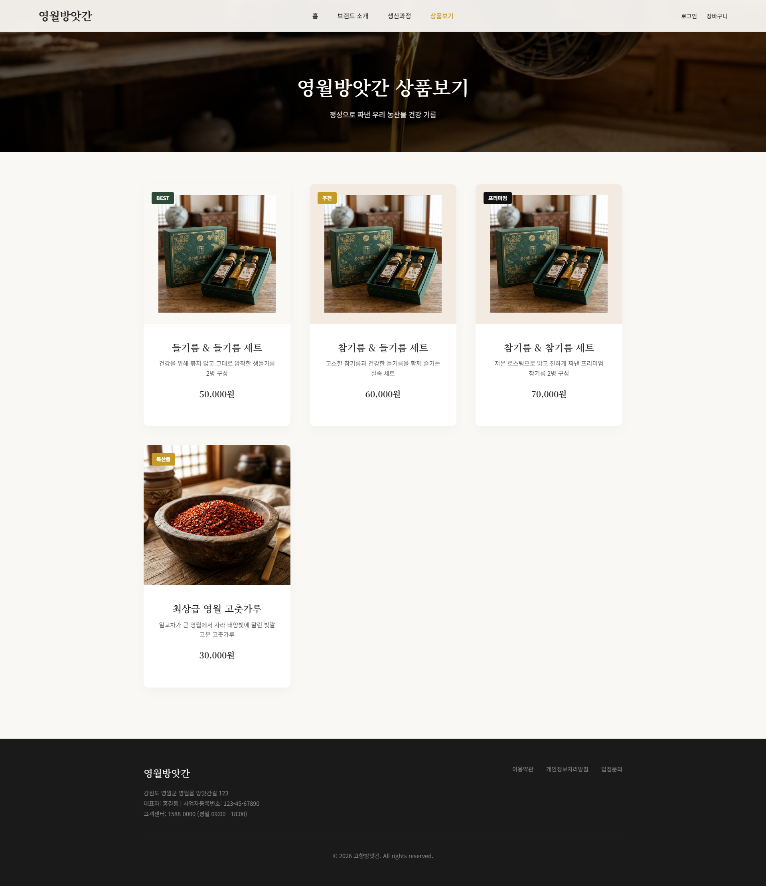

**모바일 화면 (375px)**
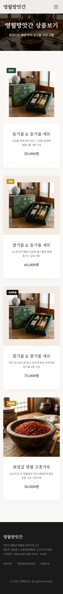

<div class="page-break"></div>

### 4.5. Product Detail (상품 상세)
제품의 상세 스펙과 고객이 가장 궁금해할 '용량', '원산지', '압착 방식'을 직관적으로 배치하고, 큼지막한 이미지로 패키지의 프리미엄함을 어필합니다.

**PC 화면 (1920px)**
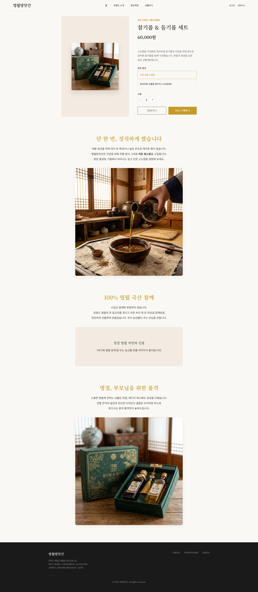

**모바일 화면 (375px)**
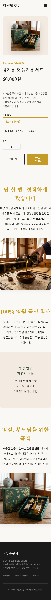

<div class="page-break"></div>

### 4.6. Cart (장바구니)
쇼핑의 마지막 단계에서 이탈(Friction)을 최소화하도록 디자인되었습니다. 주문할 상품 내역과 결제 예정 금액이 한눈에 들어오는 레이아웃입니다.

**PC 화면 (1920px)**
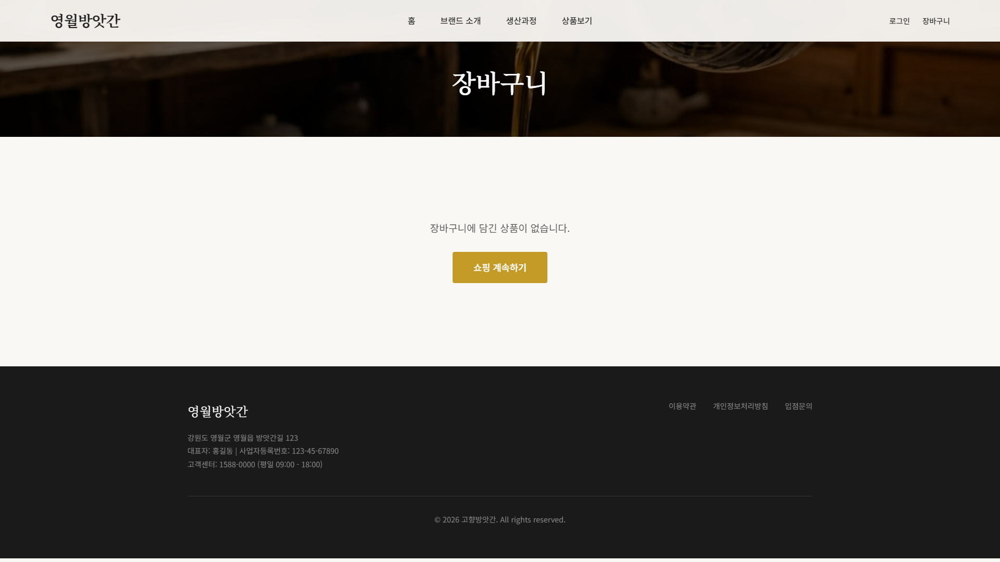

**모바일 화면 (375px)**
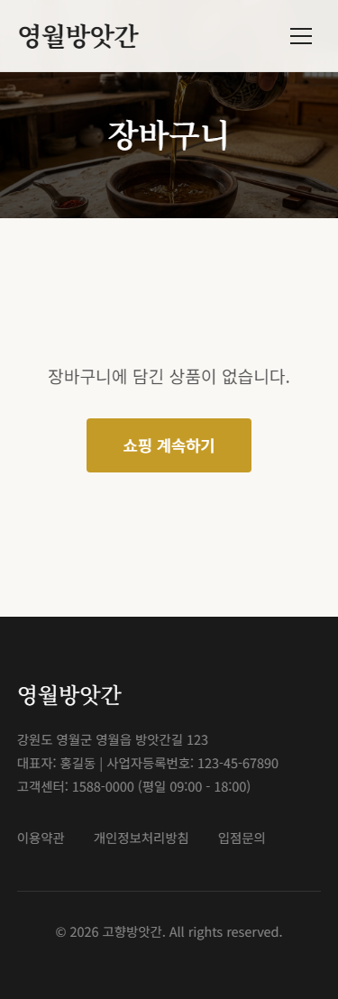

<div class="page-break"></div>

## 5. 향후 개발 및 적용 계획

본 시안(Draft 01) 확정 이후, 다음과 같은 고도화 작업 및 실제 구축 단계가 진행될 예정입니다.

### 디자인
- **실제 제품 촬영**: 임시 AI 이미지를 실제 패키지 및 브랜드 촬영본으로 교체
- **브랜드 로고 적용**: 확정된 브랜드 심볼 및 로고타입 적용
- **패키지 디자인 반영**: 실제 상품 패키지의 질감 및 컬러 요소 웹 연동

### 기능
- **결제 시스템 연동**: 신용카드 및 간편결제(네이버페이, 카카오페이 등) PG사 연동
- **회원가입/로그인**: 카카오, 구글 등 소셜 로그인 및 비회원 주문 연동
- **리뷰 시스템 연동**: 상품 신뢰도를 높이기 위한 포토 리뷰 및 평점 게시판
- **관리자 페이지**: 재고 관리, 매출 통계, 고객 관리를 위한 백오피스 셋업

### 마케팅 및 SEO
- **네이버/구글 검색 최적화**: 메타 태그, 사이트맵, 구조화 데이터 적용
- **소셜 미디어 확산**: 공유 시 노출될 OG 이미지 및 텍스트 최적화
- **채널 확장**: 네이버 스마트스토어 트래픽 연계, 인스타그램/카카오채널 연동
