# 영월방앗간 홈페이지 구축 시안 (Draft 02)

## 1. 프로젝트 개요

### 홈페이지 구축 배경 및 목적
참기름/들기름 시장은 대부분 브랜드 간의 차별성이 약하여, 소비자가 단순 가격 비교를 통해 구매를 결정하는 경향이 있습니다. **영월방앗간**은 이러한 문제를 해결하고 단순한 '기름'이 아닌 영월방앗간만의 브랜드 가치와 신뢰를 함께 전달하기 위해 기획되었습니다.

- **브랜드 신뢰도 확보 및 가치 전달**: 진정성 있는 브랜드 스토리텔링을 통해 가격 저항을 낮춥니다.
- **타겟 맞춤형 UX**: 50-60대 주 고객층을 배려한 시원한 폰트 크기, 명확한 대비, 그리고 밝고 우아한 인터페이스를 제공합니다.
- **프리미엄 이미지 구축**: 전통의 느낌을 살리되, 낡은 느낌이 아닌 '고급 백화점 식품관'에 입점할 만한 현대적이고 세련된 디자인을 지향합니다.

**본 시안의 목적**  
본 시안(`draft_02`)은 이전 `draft_01`의 리뷰 결과를 반영하여 시각적 방향성을 완전히 재정립하고, 커머스 기능(상세/장바구니/로그인)까지 모두 포함한 최종 합의용 프로토타입입니다.

<div class="page-break"></div>

## 2. 사이트맵 & 유저 플로우

### 사이트맵 (Sitemap)
직관적이고 단순한 구조를 통해 타겟 고객이 길을 잃지 않도록 4개의 메인 메뉴로 압축했습니다.

```text
HOME (영월방앗간)
├── 브랜드 소개 (brand.html)
├── 생산과정 (process.html)
├── 상품보기 (products.html)
│      └── 상품 상세 (product-detail.html) [NEW]
├── 장바구니 (cart.html) [NEW]
└── 로그인/회원가입 (login.html) [NEW]
```

### 사용자 흐름 (User Flow)
브랜드 철학에 설득되어 자연스럽게 장바구니로 이어지도록 설계된 동선입니다.
광고/SNS ➡️ **메인 홈** ➡️ **브랜드 소개/생산과정** ➡️ **상품목록** ➡️ **상세페이지** ➡️ **장바구니** ➡️ **로그인/결제**

<div class="page-break"></div>

## 3. 디자인 및 기획 의도 (Draft 02)

### 전체 톤 앤 매너 (Tone & Manner)
- **Celadon & Hanji (청자와 한지)**: 칙칙한 다크톤을 버리고, 맑고 깊은 청자빛(`Deep Celadon`)과 눈이 편안한 한지 화이트(`Hanji White`)를 베이스로 채택했습니다. 화사하면서도 가볍지 않은 한국적 우아함을 전달합니다.
- **디자인 밀도 (Density)**: 휑해 보일 수 있는 여백을 무의미한 아이콘으로 채우는 대신, 섹션별 배경색 교차 적용과 정보가 꽉 찬 확장형 푸터(Footer)를 통해 레이아웃의 완성도와 밀도를 높였습니다.

### UX 핵심 요약 (Design & UX Key Points)
1. **타겟 친화적 가독성 및 안정감**: 포인트 컬러의 명도/채도를 조절해 눈을 편안하게 하고, 요소들의 크기와 여백을 치밀하게 계산(다이어트)하여 넓은 모니터에서도 화면이 붕 뜨지 않는 '단단하고 안정적인' 레이아웃을 구현했습니다.
2. **Glassmorphism 적용**: 메인 히어로 배너 영역에 반투명한 블러(Backdrop-filter) 효과를 주어, 뒷배경의 자연 이미지와 텍스트가 고급스럽게 어우러지도록 설계했습니다.
3. **매거진 스타일의 스토리텔링**: 텍스트와 이미지가 교차하는 지그재그(Zig-zag) 레이아웃과 고대비(High Contrast) 다크 섹션을 적절히 믹스하여, 긴 브랜드 스토리도 지루함 없이 집중력 있게 읽힐 수 있도록 유도했습니다.
4. **동적 커머스 경험(Dynamic UX)**: 프론트엔드 단에서 로컬 스토리지를 활용한 실시간 장바구니 뱃지 카운팅, 자동 금액 계산 및 수량 조절 기능을 연동하여, 단순한 뷰어(Viewer)를 넘어 실제 이커머스 서비스와 동일한 쇼핑 경험을 제공합니다.

<div class="page-break"></div>

## 4. 향후 개발 및 적용 계획

본 시안(Draft 02) 확정 이후, 다음과 같은 고도화 작업 및 실제 구축 단계가 진행될 예정입니다.

### 디자인 및 퍼블리싱
- **실제 제품 촬영**: 현재 임시로 사용된 이미지를 실제 패키지 촬영본으로 교체.
- **반응형 디버깅**: 다양한 스마트폰 기기(아이폰, 갤럭시 폴드 등)에서의 미세 렌더링 조정.

### 백엔드 및 기능 개발
- **결제 시스템 연동**: 신용카드, 네이버페이, 카카오페이 등 PG사 결제 모듈 연동.
- **회원 시스템**: 소셜 간편 로그인(카카오톡 연동 필수) 및 비회원 주문 배송 조회 기능.
- **관리자 백오피스**: 상품 등록, 재고 관리, 발주 및 고객 응대를 위한 Admin 페이지 구축.

### 마케팅 및 SEO
- **검색 엔진 최적화**: 구글 및 네이버 검색 최적화(SEO)를 위한 메타 태그 및 구조화 데이터 세팅.
- **카카오톡 채널 연동**: 구매 전환 및 알림톡 발송을 위한 카카오톡 비즈니스 채널 연동.

<div class="page-break"></div>

## 5. 주요 화면 시안 (Screenshots)

### 5.1. Main Home (메인 홈)
**PC 화면 (1920px)**
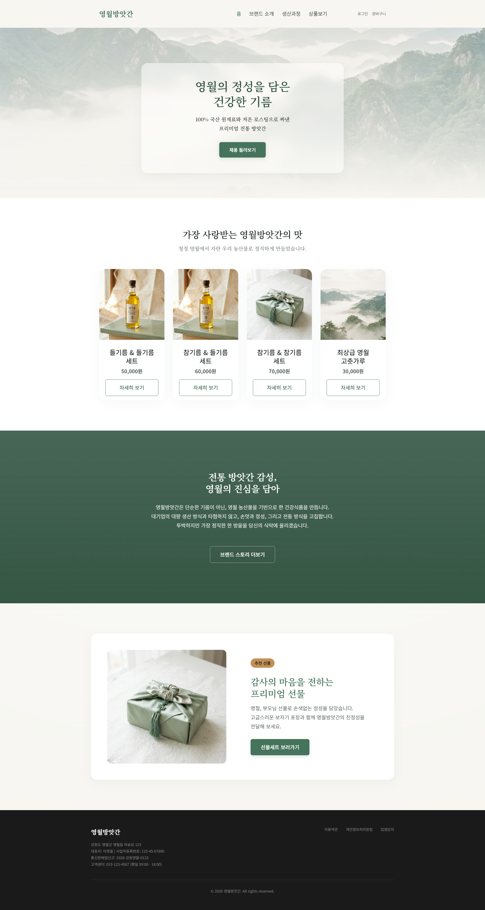
**모바일 화면 (375px)**
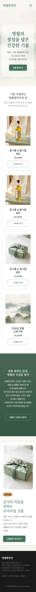

<div class="page-break"></div>

### 5.2. Brand Story (브랜드 소개)
**PC 화면 (1920px)**
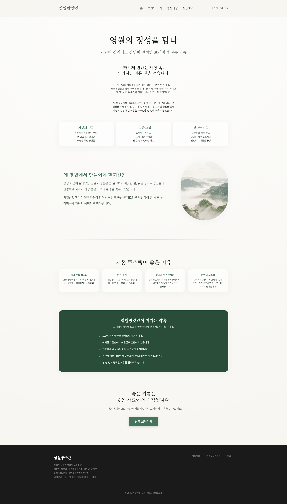
**모바일 화면 (375px)**
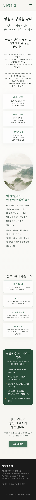

<div class="page-break"></div>

### 5.3. Process (생산 과정)
**PC 화면 (1920px)**
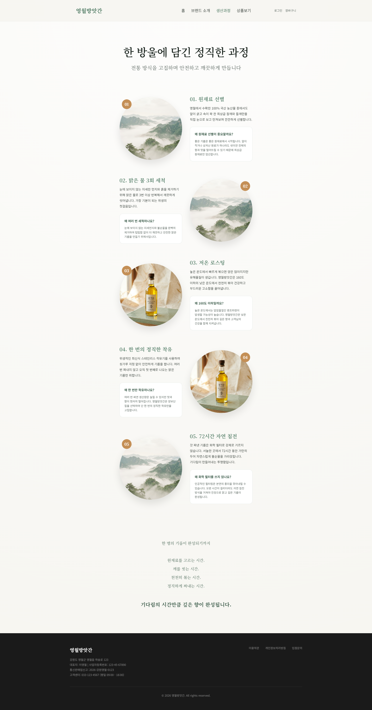
**모바일 화면 (375px)**
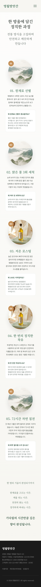

<div class="page-break"></div>

### 5.4. Products (상품 보기)
**PC 화면 (1920px)**
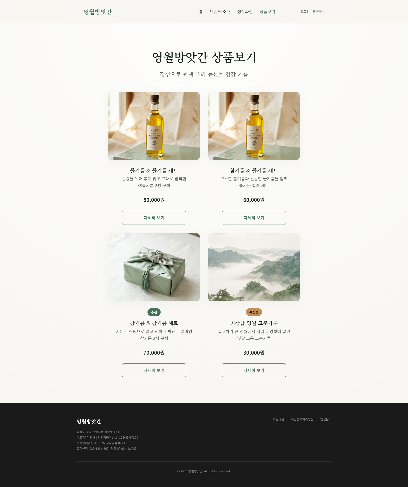
**모바일 화면 (375px)**
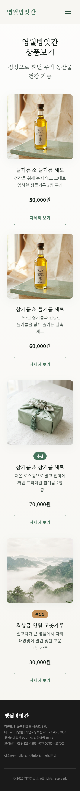

<div class="page-break"></div>

### 5.5. Product Detail (상품 상세)
**PC 화면 (1920px)**
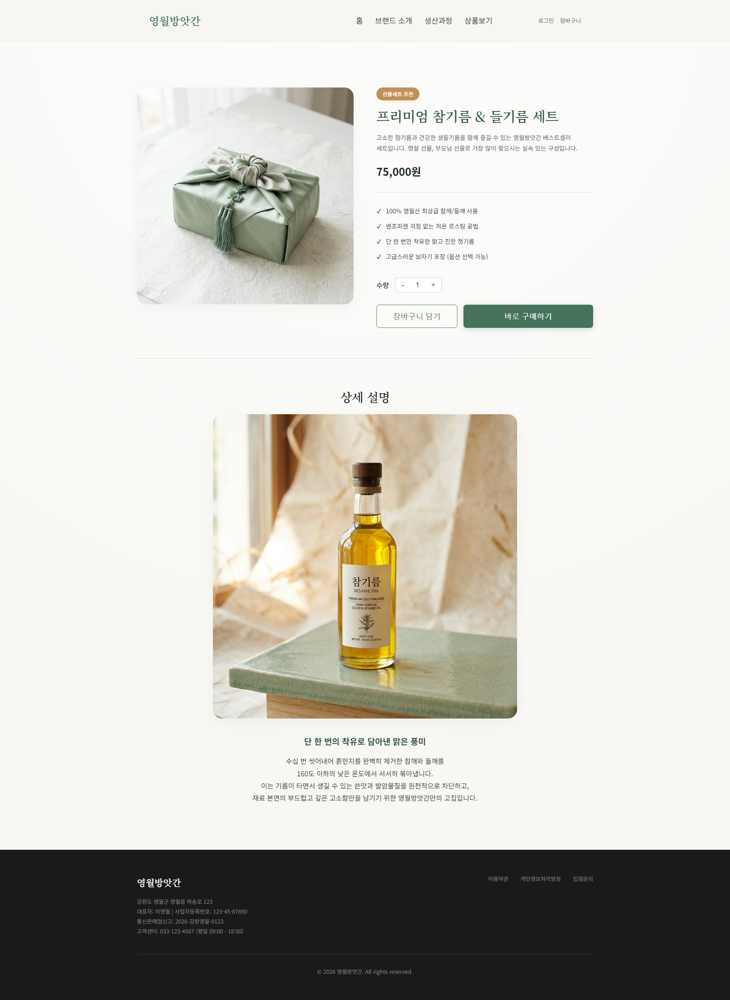
**모바일 화면 (375px)**
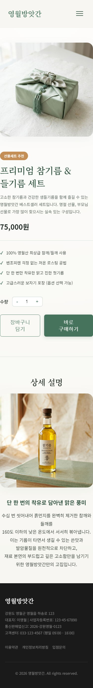

<div class="page-break"></div>

### 5.6. Cart (장바구니)
**PC 화면 (1920px)**
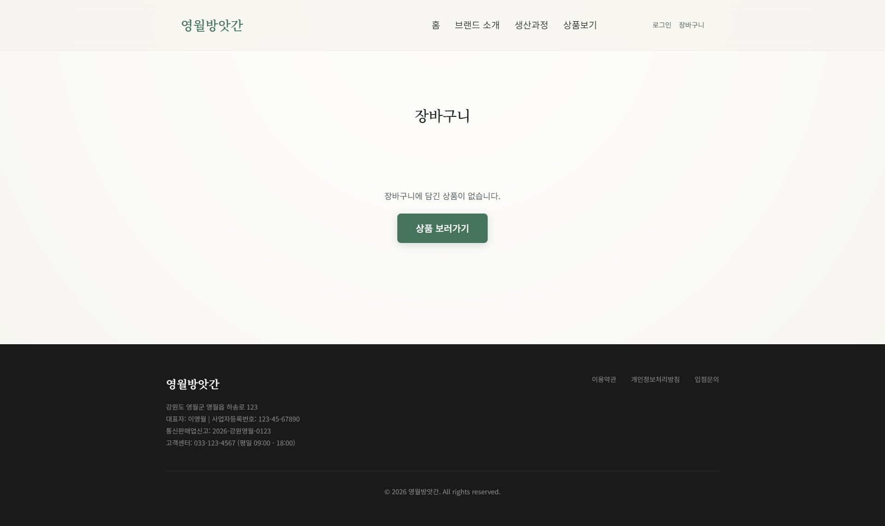
**모바일 화면 (375px)**
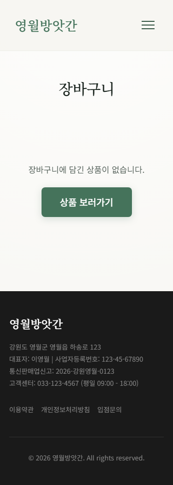

<div class="page-break"></div>

### 5.7. Login (로그인)
**PC 화면 (1920px)**
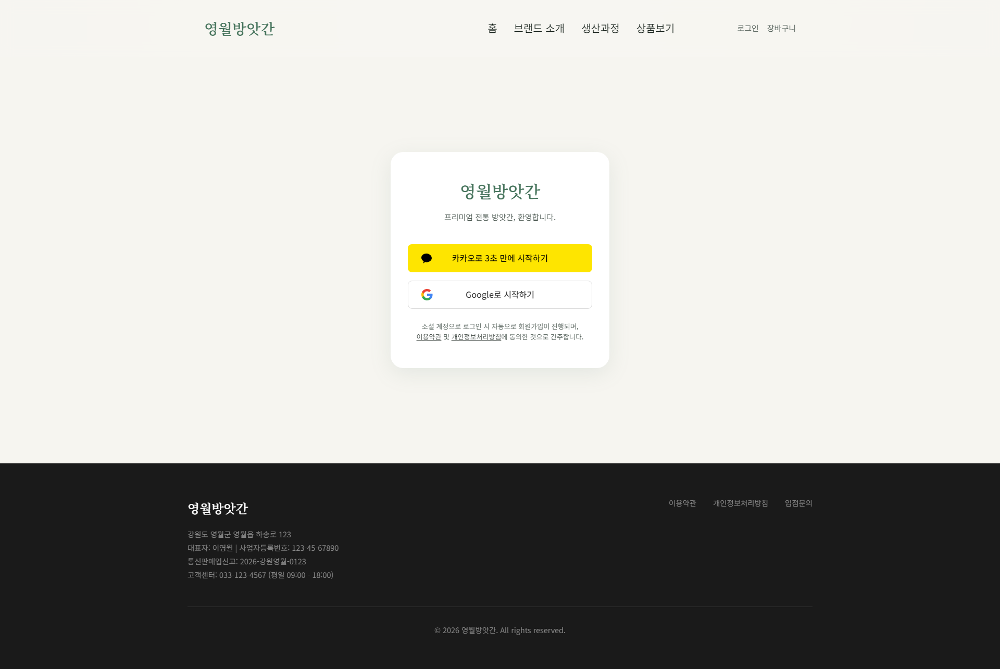
**모바일 화면 (375px)**
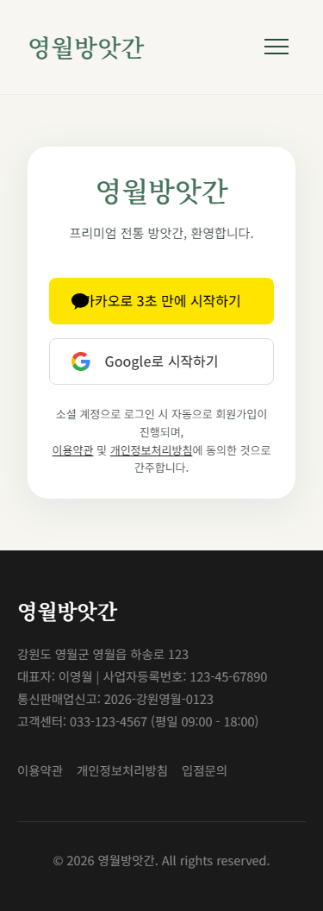


